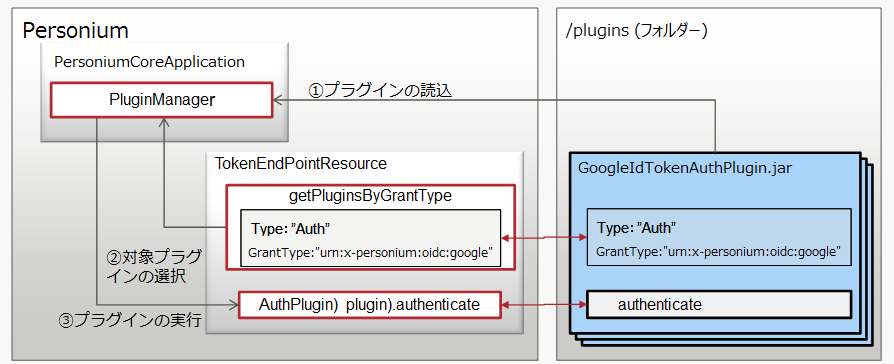
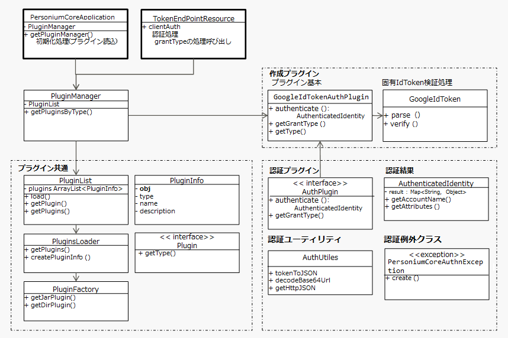
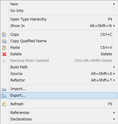
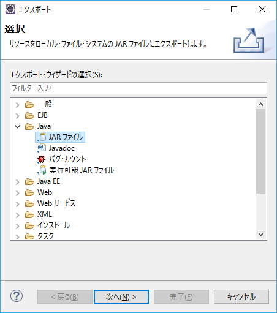
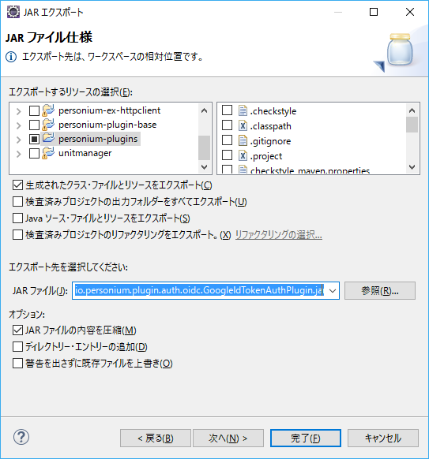
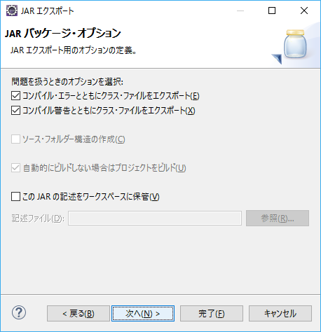
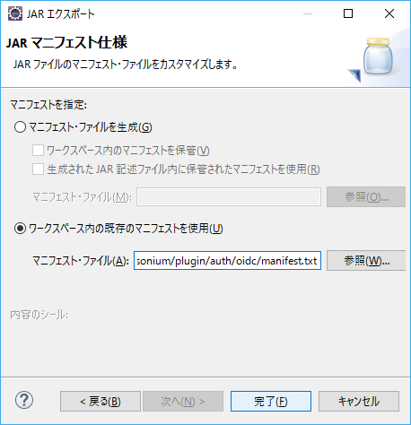

Personium認証プラグイン開発ガイド
======

この文書はPersonium認証プラグインの開発マニュアルです。

この文書について
------

Personiumの認証プラグインを開発する上で必要となる情報を記述しています。
このドキュメントでは、認証プラグインの作成手順を説明します。

## 認証プラグインとは

Personium認証プラグインはCellが持つOAuth2トークンエンドポイントの振舞を拡張するためのものです。
認証プラグインをユニットに導入することで、そのユニット上のすべてのCellのOAuth2トークンエンドポイントにはプラグインに定義された拡張された振舞が追加されます。
OAuth2においてトークンエンドポイントは、リソースアクセスのためのアクセストークン発行を担うものです。
OAuth2.0仕様では、このエンドポイントの必須パラメタであるgrant_typeは仕様上の定義値である以下値の他にも任意の絶対URIを定義して使用可能となっています。

- ・authorization_code  (未サポート）
- ・password
- ・refresh_token
- ・client_credentials  (未サポート）

参考: https://tools.ietf.org/html/rfc6749#section-4.5

Personium認証プラグインはこれと対応する形で記述するものです。

## 開発の方法

具体的にはプラグインでは以下の2点を定義します。

* 1.どのようなgrant_type値に対応すべきなのか
* 2.トークンエンドポイントのgrant_type以外の入力パラメタ値をどのように評価して、結果としてどのような主体として認識すべきなのか

即ちプラグイン作者は、上記2点の情報を具体的なJavaコードとして実装します。
Personiumでは認証プラグインが上記2の応答として返却した認証済み識別主体情報(AuthenticatedIdentityオブジェクト）を以下の観点でさらに評価して、
トークン発行の可否判断や、発行トークンの内容決定、トークン発行処理を行います。

- ・getAccountName() で取得できる文字列をName属性にもつAccountが存在するか
- ・存在する場合、ヒットしたAccountのtype値にgrant_typeパラメタのurn: 以下の文字列が含まれているか

## セキュリティ上の配慮

当然のことながら、プラグイン作者は上記2の「パラメタ値評価」においては一般的にアクセス主体が適切な認証プロセスを経るように実装を行う必要があります。
例えば、入力値を一切チェックせずに本来保護されるべき特定の主体（ゲスト等でない実在の人物など）
として認識してしまうようなプラグインを作成し、これをユニットに配置してしまうことは重大なセキュリティ問題を引き起こします。
従ってプラグイン作者はセキュアな実装を行うこと、プラグイン利用者（ユニット管理者）はセキュアであると信じられるプラグインのみを用いることが必要です。

---

以下、google版の認証プラグインを例に説明します。

## プラグインのクラス構造

作成プラグインの枠線部分が作成の対象です。

認証プラグインのクラス構造図を以下に示します。


> **注意:**  認証処理の戻り値
> - 認証に成功した場合は、AuthenticatedIdentityが返却されます。
> - 認証に失敗した場合は、PersoniumCoreAuthnExceptionが投げられます。

## プラグインの動作

認証プラグインの動作を以下に示します。



　1. プラグイン初期化処理
　    PersoniumCoreApplicationクラスでPluginManagerが呼出され、すべてのプラグインを読み込みます。

　2. 認証プロセスの呼び出し
　   TokenEndPointResourceクラスで対象のGrantTypeのプラグインを選択します。
　   選択したプラグインのauthenticateメソッドを実行します。

> **注意:**
> - Personiumプラグインは、pluginsフォルダに配置するだけで実行可能です。
> - 認証プラグインは、Typeに”Auth”とGrantTypeに各プロバイダを指定し、authenticateメソッドを記述することで、対象のpluginが選択されauthenticateメソッドが実行されます。

### 1.プラグイン初期化処理
####<i class="icon-file"></i>PersoniumCoreApplication.java
```
public class PersoniumCoreApplication extends Application {
    private static PluginManager pm;

    static {
        try {
            TransCellAccessToken.configureX509(PersoniumUnitConfig.getX509PrivateKey(),
                    PersoniumUnitConfig.getX509Certificate(), PersoniumUnitConfig.getX509RootCertificate());
            LocalToken.setKeyString(PersoniumUnitConfig.getTokenSecretKey());
            DataCryptor.setKeyString(PersoniumUnitConfig.getTokenSecretKey());
            pm = new PluginManager();
        } catch (Exception e) {
            PersoniumCoreLog.Server.FAILED_TO_START_SERVER.reason(e).writeLog();
            throw new RuntimeException(e);
        }
    }
```
pm = new PluginManager();
PluginManagerクラスを生成します。

---
### 2.認証プロセスの呼び出し
####<i class="icon-file"></i>TokenEndPointResource.java
```
            PluginManager pm = PersoniumCoreApplication.getPluginManager();    // Plugin manager.
            PluginInfo pi = pm.getPluginsByGrantType(grantType);        // Search target plug-in.
            if (pi == null) {                                           // Plug-ins do not exist.
                throw PersoniumCoreAuthnException.UNSUPPORTED_GRANT_TYPE.realm(this.cell.getUrl());
            }
            AuthenticatedIdentity ai = null;
            // Invoke the plug-in function.
            Map<String, String> body = new HashMap<String, String>();
            body.put(AuthConst.KEY_TOKEN, idToken);
            Object plugin = (Plugin) pi.getObj();
            try {
                ai = ((AuthPlugin) plugin).authenticate(body);
            } catch (PersoniumCoreAuthnException e) {
                PersoniumCoreAuthnException pcae = PersoniumCoreAuthnException.mapFrom(pe);
                if (pcae != null) {
                    throw pcae;
                }
                throw PersoniumCoreAuthnException.Plugin.PLUGIN_DEFINED_CLIENT_ERROR.reason(pe);

            } catch (Exception e) {
                // Unexpected exception throwed from "Plugin", create default PersoniumCoreAuthException
                // and set reason from catched Exception.
                throw PersoniumCoreException.Plugin.UNEXPECTED_ERROR.reason(e);
            }
```
---
## プラグインの作成手順

以下の手順に従ってpluginを作成します。

　1. Javaソースプログラムの作成
　2. マニフェストファイルの作成
　3. Jarファイルのエクスポート
　4. Jarファイルの配置
　5. プラグインのテストとデバッグ

---
###  1. Javaソースプログラムの作成

GoogleIdTokenAuthPlugin.javaをコピーして、**google** と記述されているすべての部分を、これから作成する認証プラグインの名前に置換します。

---
####<i class="icon-file"></i> **GoogleIdTokenAuthPlugin.java**
```
/**
 * personium.io
 * Copyright 2017 FUJITSU LIMITED
 *
 * Licensed under the Apache License, Version 2.0 (the "License");
 * you may not use this file except in compliance with the License.
 * You may obtain a copy of the License at
 *
 *     http://www.apache.org/licenses/LICENSE-2.0
 *
 * Unless required by applicable law or agreed to in writing, software
 * distributed under the License is distributed on an "AS IS" BASIS,
 * WITHOUT WARRANTIES OR CONDITIONS OF ANY KIND, either express or implied.
 * See the License for the specific language governing permissions and
 * limitations under the License.
 */
package io.personium.plugin.auth.oidc;

import java.util.Map;

import io.personium.plugin.base.PluginConfig.OIDC;
import io.personium.plugin.base.PluginLog;
import io.personium.plugin.base.PluginException;
import io.personium.plugin.base.auth.AuthPlugin;
import io.personium.plugin.base.auth.AuthConst;
import io.personium.plugin.base.auth.AuthenticatedIdentity;

public class GoogleIdTokenAuthPlugin implements AuthPlugin {
    /** to String. **/
    public static final String PLUGIN_TOSTRING = "Google Open ID Connect Authentication";

    /** urn google grantType. **/
    public static final String PLUGIN_GRANT_TYPE = "urn:x-personium:oidc:google";

    /**
     * toString.
     * @return String
     */
    public String toString(){
        return PLUGIN_TOSTRING;
    }

    /**
     * getType.
     * @return String
     */
    public String getType() {
        return AuthConst.TYPE_AUTH;
    }

    /**
     * getGrantType.
     * @return String
     */
    public String getGrantType() {
        return PLUGIN_GRANT_TYPE;
    }

    /**
     * Google URL
     */
    public static final String URL_HTTPS = "https://";
    public static final String URL_ISSUER = "accounts.google.com";

    /**
     * Type値 oidc:google.
     */
    public static final String OIDC_PROVIDER = "google";

    /**
     * authenticate.
     * @return au AuthenticatedIdentity
     * @throws PluginException
     */
    public AuthenticatedIdentity authenticate(Map <String, String> body) throws PluginException {
        AuthenticatedIdentity ai = null;
        if (body == null) {
            throw PluginException.Authn.REQUIRED_PARAM_MISSING.params("Body");
        }

        // verify idToken
        String idToken = (String)body.get(AuthConst.KEY_TOKEN);
        if (idToken == null) {
            throw PluginException.Authn.REQUIRED_PARAM_MISSING.params("ID Token");
        }

        GoogleIdToken ret = null;
        try {
            // id_tokenをパースする
            ret = GoogleIdToken.parse(idToken);
        } catch(PluginException pe){
            throw PluginException.Authn.OIDC_INVALID_ID_TOKEN;
        }

        // Tokenの検証   検証失敗時にはPluginExceptionが投げられる
        ret.verify();

        String issuer = ret.getIssuer();
        String aud  = ret.getAudience();
        String mail = ret.getEmail();

        // Token検証成功の後処理
        // Googleが認めたissuerであるかどうか
        if (!issuer.equals(URL_ISSUER) && !issuer.equals(URL_HTTPS + URL_ISSUER)) {
            PluginLog.OIDC.INVALID_ISSUER.params(issuer).writeLog();
            throw PluginException.Authn.OIDC_AUTHN_FAILED;
        }

        // Googleに登録したサービス/アプリのClientIDかを確認
        // DcConfigPropatiesに登録したClientIdに一致していればOK
        if (!OIDC.isProviderClientIdTrusted(OIDC_PROVIDER, aud)) {
            throw PluginException.Authn.OIDC_WRONG_AUDIENCE.params(aud);
        }

        // 正常な場合、AuthenticatedIdentity を返却する。
        ai = new AuthenticatedIdentity();
        // アカウント名を設定する
        ai.setAccountName(mail);
        // OIDC TYPEを設定する
        ai.setAttributes(AuthConst.KEY_OIDC_TYPE, AuthConst.KEY_OIDC_TYPE + ":" + OIDC_PROVIDER);

        return ai;
    }
}
```
Authenticationが正常の場合は、AuthenticatedIdentityを返却します。

---
### 2. マニフェストファイルの作成

**Jarファイル** を生成するには、manifest.txtファイルを作成します。

#### <i class="icon-file"></i>**manifest.txt**
```
Manifest-Version: 1.0
Plugin-Class: io.personium.plugin.auth.google.code.GoogleIdTokenAuthPlugin
```
jarファイルを作成する情報を記述します。Plugin-Classは、package+クラス名の形式です。

---
### 3. Jarファイルのエクスポート

####<i class="icon-file"></i>GoogleIdTokenAuthPlugin.jar

Eclipseを使用してJarファイルを作成します。

1) 作成したプラグインを選択し、右クリックで表示されたメニューの「Export...」をクリックします。


2) 「Java – JAR file」を選択し、「Next >」をクリックします。


3) 作成するJarファイルのパスと名前を指定し、「Next >」をクリックします。


4) 指定せずに「Next >」をクリックします。


5) マニフィストファイルを指定し、「Finish」をクリックします。

指定したパスにJarファイルが作成されます。

---
### 4. Jarファイルの配置
#### <i class="icon-hdd"></i>personium-unit-config.properties
```
# 一般的な構成
io.personium.core.plugin.path=/personium/personium-core/plugins
```
personium-unit-config.propertiesファイルに設定したpluginsフォルダのパスに、作成したJarファイルを配置してください。

---
### 5. プラグインのテストとデバッグ

#### <i class="icon-file"></i>**PluginTest.java**
io.personium.test.plugin

最後のステップは、テストとデバッグです。
今回作成したプラグインをjunitでテストするには、PluginTest.javaにテスト処理のメソッドを追加します。
作成したjunitを実行して、動作が正常に終了することを確認してください。

---
